# Cartesi Rollups + EIP-4844 "blobs"

As of now, the `InputBox` contract accepts input payloads received as transaction `calldata`, which are then emitted through `InputAdded` events, to be fetched by reader nodes later.
For large payloads, this might be an expensive operation.
To counter the abuse of `calldata`, EIP-4844 introduced blob-carrying transactions. Different from `calldata`, blobs are transient, in the sense that Ethereum nodes have no obligation (past some time frame) to keep and serve them to clients, allowing them to be a cheaper DA alternative to `calldata`.
During the execution of contract code, the versioned hashes of these blobs can be accessed via the newly-added EVM instruction known as `BLOBHASH`.

This project aims to create a contract whose sole job is to send to some application an input whose payload contains the versioned hashes of all the blobs included in the transaction. Inside the machine, these hashes can be converted to their pre-images through a Generic I/O request. We believe a demo version of this "driver" can be bootstrapped using NoNodo.
During disputes, the response could be proved through the KZG commitments and proofs that are included in the transaction, which can be much shorter than the blobs themselves, and be passed as `calldata` to a `MerkleProvider` contract. This part is being left out of the scope of this project intentionally, and left as future work.

## From the user to the Cartesi machine

Let's take a look at what happens when a user sends a blob-carrying transaction to a Cartesi application.
The diagram below should guide you in this journey, so feel free to consult it while reading this explanatory text.
First, the application front-end, which is running on the user's browser, triggers the user's wallet browser extension (e.g. Metamask) to sign a transaction.
This transaction carries the user input in the form of a blob, instead of in the traditional `calldata` form.
Once the the transaction is signed, submitted, and included in a finalized Ethereum block, some stuff happens on-chain.

During the execution of the transaction, the following happens.
First, the target address is triggered, in this case the `VersionedBlobHashPortal` contract.
This contract builds an input with the message sender and the versioned hash of all the blobs of the current transaction.
It's important to mention that each Ethereum block can contain up to 6 blobs, and it is possible to send more than one blob in the same transaction.
With the input it has just built, the portal contract sends it to the `InputBox` contract, where it will be emitted in an `InputAdded` event.

This input will take the usual journey from the blockchain to the Cartesi machine.
For every finalized Ethereum block, the Cartesi node will check for `InputAdded` events emitted by the `InputBox` contract.
It then adds such inputs to a database, to be read by an internal service responsible for running the Cartesi machine.
Once the machine requests the next input, this service will read it from the database, write it to a so-called `rx` buffer, and resume its execution.

Inside the Cartesi machine, this `rx` buffer is read and served to the application back-end through an HTTP API.
This server also decodes the input into a meaningful structure that also contains some metadata added by the `InputBox` contract.

```mermaid
flowchart TB

    subgraph Ethereum
        VersionedBlobHashPortal
        InputBox
    end

    subgraph User Browser
        AppFrontend[App Front-end]
        Wallet["Wallet (e.g. Metamask 🦊)"]
    end

    CartesiNode[Cartesi Node]

    subgraph Cartesi Machine
        rxBuffer[rx buffer]
        HTTPAPI[HTTP API]
        AppBackend[App Back-end]
    end

    AppFrontend -- suggests tx w/ blob(s) --> Wallet
    Wallet -- submits tx w/ blob(s) --> VersionedBlobHashPortal
    VersionedBlobHashPortal -- adds input w/ blob hash(es) --> InputBox
    InputBox -- reads input from event --> CartesiNode
    CartesiNode -- writes input to --> rxBuffer
    rxBuffer -- provides input to --> HTTPAPI
    HTTPAPI -- serves decoded input to --> AppBackend
```



## Getting a blob from its versioned hash

The next step for the application back-end is to convert versioned blob hashes into the blobs themselves.
Such conversion is possible thanks to the GIO feature that has been recently incorporated into the Machine Emulator SDK.

> [!IMPORTANT]
> As of this writing (June 2024), the Cartesi node doesn't yet support the GIO feature.
> So, for demonstration purposes, we've used NoNodo instead.

Everything starts with the application back-end sending a GIO request to the HTTP server running inside the Cartesi machine.
The HTTP request body of any GIO request is a JSON containing a domain and an ID.
We've decided to use 4844 as the domain, taking inspiration from EIP-4844.
Meanwhile, the ID is simply the versioned hash of the blob.
In the end, we'd like the HTTP response to be the blob itself.
Let's see how can we go from one to the other.

Whenever the HTTP server receives a GIO request, it is forwarded to the machine supervisor through a so-called `tx` buffer.
It is similar to the aforementioned `rx` buffer, but works in the opposite direction, to transmit data from inside to outside the machine.
The data, in this case, is the GIO request, with the same aforementioned fields: domain and ID.

When the machine supervisor—in this case, the machine runner service of the Cartesi node monolith—is informed of a manual yield, it goes to investigate the reason.
The reason, in the case of a GIO request, is the domain itself.
If the Cartesi node is properly configured, it will know how to handle a GIO request with domain 4844.

> [!NOTE]
> In the reference implementation of the Cartesi node, it is not yet defined how GIO request will be configured by the node runner.
> In our demo, we've hard-coded the handling of GIO requests with domain 4844 into the NoNodo development node.

Now, here comes a great question: how to obtain a blob from its versioned hash?
It's clear that we cannot brute force this operation, because there is a robust cryptographic hash function at play, namely SHA-256.
One option would be for the node runner to spin up an Ethereum consensus node, and query blob content through the Beacon API.
This path, although decentralization-friendly, can be infrastructure-costly.
Another option is to query this data from a blob service provider, like Blobscan.
The node runner wouldn't even have to trust the blob service provider, as they could independently check the KZG proofs.
In the worst case scenario, the blob service provider could be unresponsive or provide false data.
Both would harm liveness, but not the security of the Cartesi application.
In such cases, the node runner could switch to the safe option, which is to run an Ethereum consensus node themselves.

> [!IMPORTANT]
> Due to time constraints, our demo queries blob content from Blobscan, but does not check the KZG proofs.
> For production-level implementations, we highly advise verifying blobs against the KZG proof, commitment, and versioned blob hash.

It's also worth noting that the application developer and node runner must agree on the set of valid blobs.
They could agree on a fixed set of known blobs, or on a dynamic set of blobs (like those sent by the `VersionedBlobHashPortal` contract).
They could also agree on the set of all blobs in the network (that have not expired yet).
On the extreme case, they could even agree on a set of blobs from multiple networks.

> [!IMPORTANT]
> In our demo, we query blob content from Blobscan Sepolia, which encompasses all blobs submitted to Ethereum Sepolia.
> If we're open to the idea of multi-chain DA, we could add a chain ID parameter to the GIO request ID.
> Such parameter could work as a hint to the node runner, and be totally ignored by arbitration.

If the node runner is not able to obtain the requested blob from the set of valid blobs, then the application is broken.
Otherwise, the node runner is able to obtain the blob, writes it to the `rx` buffer and resumes the machine.
The HTTP server then reads the GIO response from the `rx` buffer, and forwards it to the application back-end.

And that's the end of the pipeline! Now, the application can do whatever it wants with the blob. 🫧

```mermaid
flowchart TB

    subgraph Cartesi Machine
        AppBackend[App Back-end]
        HTTPAPI[HTTP API]
        txBuffer[tx buffer]
        rxBuffer[rx buffer]
    end

    CartesiNode[Cartesi Node]

    BlobServiceProvider["Blob service provider \n (e.g. Blobscan 🫧🔍)"]

    AppBackend -- (1) /gio \n { #quot;domain#quot;: 4844, #quot;id#quot;: #quot;#lt;versioned_blob_hash#gt;#quot; } --> HTTPAPI
    HTTPAPI -- (2) writes gio request to --> txBuffer

    txBuffer -- (3) reads gio request from --> CartesiNode
    CartesiNode -- (4) versioned blob hash --> BlobServiceProvider
    BlobServiceProvider -- (5) blob --> CartesiNode
    CartesiNode -- (6) writes gio response to --> rxBuffer

    rxBuffer -- (7) reads gio response from --> HTTPAPI
    HTTPAPI -- (8) blob --> AppBackend
```



## Running NoNodo

Because the reference implementation of the Cartesi node for the Rollups SDK v2 is not ready yet, we've decided to hack NoNodo instead.
You can see the changes made to the NoNodo codebase in the [`feature/eip-4844`](https://github.com/Calindra/nonodo/tree/feature/eip-4844) branch.

```sh
git clone https://github.com/Calindra/nonodo.git
cd nonodo
git checkout feature/eip-4844
go mod install
go build
```

We've deployed all the necessary contracts to the Ethereum Sepolia test network, so you can test out the project there.
Here's how you're able to run NoNodo while listening to inputs from the `InputBox` contract deployed to Sepolia.
Make sure you set the `RPC_URL` environment variable appropriately (you can use any service provider, like Alchemy or Infura).
Just make sure to use WebSocket, because HTTP doesn't support notifications (required for `eth_subscribe`).
For testing purposes, you can set the `APPLICATION_CONTRACT` environment variable to a dummy address.

```sh
./nonodo \
    --enable-echo \
    --contracts-application-address "$APPLICATION_CONTRACT" \
    --contracts-input-box-address 0x58Df21fE097d4bE5dCf61e01d9ea3f6B81c2E1dB \
    --contracts-input-box-block 6099597 \
    --rpc-url "$RPC_URL"
```

> [!NOTE]
> We believe it would be possible to have a functioning local setup, but it would require an Ethereum consensus client
> like Prysm or Lighthouse running locally. Also, this would require modifications in the NoNodo patch that handles GIO
> requests with domain 4844, because we would need to communicate with the CL node through the Beacon API.

## References

### EIP-4844

- [EIP-4844 spec](https://eips.ethereum.org/EIPS/eip-4844)
- [EIP-4844 website](https://www.eip4844.com/)
- [EIP-4844 L2 TX usage & blob lifetime](https://hackmd.io/@protolambda/blobs_l2_tx_usage)
- [EIP-4844 dev usage](https://github.com/colinlyguo/EIP-4844-dev-usage)

### Sending blob transactions

- [Viem](https://viem.sh/docs/guides/blob-transactions)

### Querying blobs

- [Blobscan (Sepolia)](https://sepolia.blobscan.com/)
- [Blobscan API (Sepolia)](https://api.sepolia.blobscan.com/)

### Convenience & Tooling

- [NoNodo (Development node)](https://github.com/Calindra/nonodo)

### Cartesi SDK

- [Machine Emulator Tools v0.15.0](https://github.com/cartesi/machine-emulator-tools/tree/v0.15.0)
- [Cartesi gRPC Interfaces v0.16.0](https://github.com/cartesi/grpc-interfaces/tree/v0.16.0)
